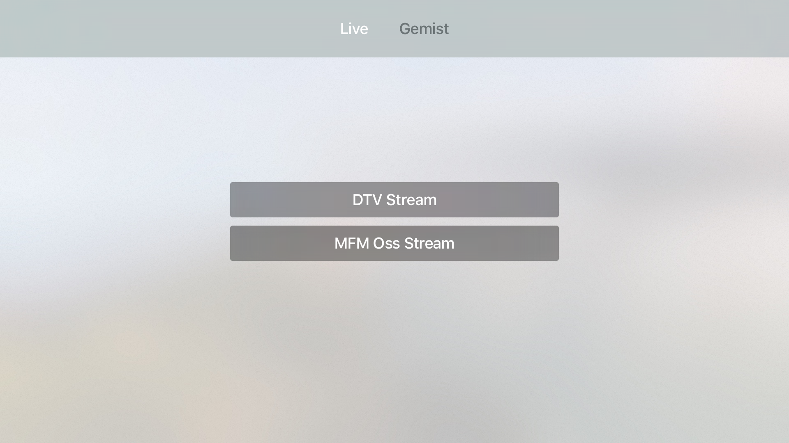

# StreamOne Apple TV Demo Application

This repository contains a demo application which can be used by (local) broadcasters to show their livestreams and recorded media from the StreamOne Cloud Platform. It uses the [StreamOne Swift SDK](https://github.com/StreamOneNL/iOS-SDK) to communicate with the StreamOne Platform.

The application is intended to be a starting point for everyone wanting to create an Apple TV application. It does require some knowledge about tvOS development to modify it to your likings.

## Screenshots

[](screenshots/screenshot-1.png)
[](screenshots/screenshot-2.png)
[](screenshots/screenshot-3.png)
[](screenshots/screenshot-4.png)
[](screenshots/screenshot-5.png)

## Getting started

This project uses [Carthage](https://github.com/Carthage/Carthage) for dependency management. Make sure you have Carthage installed and then run the following command in a Terminal window in the directory where you cloned this repository:

```bash
carthage update --no-use-binaries --platform tvos --use-submodules
```

It might be the case that you need to do this more than once, as there is a bug in the `Crypto` dependency of this project. If the above command fails, just run it again.

Next, you need to copy the file `AppleTV-Demo/ApiSettings.dist.plist` to `AppleTV-Demo/ApiSettings.plist` and fire up XCode. The file will be available in `AppleTV-Demo/AppleTV-Demo/Resources/ApiSettings.plist`. Edit this file to contain your StreamOne account settings.

The demo application uses an URL scheme called `s1-demo://` to be able to open the app from a Top Shelf item. Make sure you edit this scheme because otherwise it will conflict with other applications. This scheme needs to be changed in two places:

* The `Info.plist` file of the application
* The `Constants.swift` file

## Changing what to show

By default the app will show a tab with all livestreams configured in the `livestreams` key of the `ApiSettings.plist` file to be able to stream live and one tab for every livestream in the `gemiststreams` key of the same file to show   recorded items for that livestream. If you do not link items to a livestream, you can set the `showaccounttab` to true to show **all** items in the account in a separate tab.

## License and copyright

All source code is licensed under the [MIT License](LICENSE).

Copyright (c) 2016 [StreamOne B.V.](https://streamone.nl)
